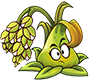
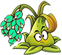
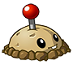
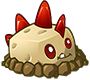
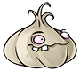
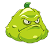

# 🌻Plants vs Zombies🧟‍♀️
**Hey body, I hope you're doing great.  
We're excited that you're about to experience our game!  
In this project, we combined the popular and classic Plants vs Zombies game with the famous Rush Royale game you play on your phones. We've created our own unique version, packed with excitement and fun!😍   
We hope you enjoy playing this game and have a great time with it.😅**

  
## Game Features
- **Simple and attractive graphics**  
- **Various plants to fight with zombies**  
- **Enemies with unique abilities**  
- **Ability to save your record in the game**
- **Attacks come in multiple waves by the enemies**

  
# Introduction of Characters
## Plants🌱
**Plants are either planted in pots or placed in the path of zombies to destroy them. Below is a list of the different types of plants you can use in the game:**  
### Gorbemahi🐱
**Gorbemahi shoots randomly at enemies on the battlefield.**  
Power: Depends on level (30-60-120-240-480)  
Fire Rate: 1500  
Elixir Cost: 4  
**Its appearance evolves from Level 1 to Level 5 as follows:**  

      
### Kalam🥬
**Kalam shoots at the strongest enemy on the battlefield.**  
Power: Depends on level (22-44-88-176-352)  
Fire Rate: 1400  
Elixir Cost: 3  
**Its appearance evolves from Level 1 to Level 5 as follows:**  

    
### Gol Moshaki🚀
**Gol Moshaki shoots at the first enemy on the battlefield.**  
Power: Depends on level (15-30-60-120-240)  
Fire Rate: 1200  
Elixir Cost: 2  
**Its appearance evolves from Level 1 to Level 5 as follows:**  

    
### Gandom🌾
**Gandom shoots at the last enemy on the battlefield.**  
Power: Depends on level (15-30-60-120-240)  
Fire Rate: 1200  
Elixir Cost: 2  
**Its appearance evolves from Level 1 to Level 5 as follows:**  

    

### Bomb💣
**Bombs are placed in the path of enemies and, depending on their level, can destroy between two to six enemies. bombs will explode three seconds after being placed.**  
Power: Depends on level (Kills 2-7 enemies)  
Explosion Time: 3 seconds after being placed  
Elixir Cost: 2  
**Its appearance evolves from Level 1 to Level 5 as follows:**  

    
### Trap🚨
**Traps are placed in the path of enemies and, depending on their level, can destroy between two to six enemies. traps will not disappear until they have killed their assigned number of enemies.**  
Power: Depends on level (Kills 2-7 enemies)    
Elixir Cost: 2  
**Its appearance evolves from Level 1 to Level 5 as follows:**  

      
  
  
## Zombies🧟‍♂️  
### **Boss**👹  
**Bosses are fewer in number but have greater resistance, and they possess a special ability to retaliate against plants.**  
#### Disarmer  
  
The Disarmer is a boss with a unique ability to disable all bombs and traps on its path.  
Speed: 0.25 * (1.1 * wave number)
Health: 2000 * (1.1 * wave number)
#### Freezer  
  
This boss can randomly freeze one of the agents(plants) from the game field every five seconds. While frozen, the affected agent is unable to attack or perform any actions as long as the Freezer is alive.  
Speed: 0.25 * (1.1 * wave number)
Health: 2000 * (1.1 * wave number)  
special ability period: every 5 seconds
#### Eraser  
  
This boss can randomly remove one of the plants from the game field every seven seconds and destroy it.  
Speed: 0.25 * (1.1 * wave number)
Health: 2000 * (1.1 * wave number)  
special ability period: every 7 seconds  

### **Soldier**👨‍✈  
**Soldiers are enemies that usually appear in greater numbers, but unlike bosses, they have less health and are less resistant to attacks.**
#### Runner  
  
Runners are a group of soldiers known for their high speed, but their lower health makes them more vulnerable to attacks.  
Speed: 1 * (1.1 * wave number)
Health: 50 * (1.1 * wave number)  
#### Shielder  
  
Shielders are a group of soldiers built for defense. Although they are slower than Runners, their higher health allows them to withstand more attacks.  
Speed: 0.5 * (1.1 * wave number)
Health: 100 * (1.1 * wave number)  

## Game Description🎮
- **There is a bar at the bottom of the screen containing different plants. Click on them and then click on one of the pots on the game screen to plant the plant, which will shoot zombies.**

   
- **Bombs and traps are also available in the bottom bar, and you need to place them in the zombies' path to use them effectively.**

       
- **The right bar of the screen shows the level of each plant. If you have enough elixir, you can click on them to level up the plant, which increases its power.**

- **The green bottle at the bottom of the screen displays your elixir count, which increases every second, but it can reach a maximum of 10. Planting or leveling up plants will decrease your elixir count.**                                                              

  

- **You have three hearts, which are shown by the heart next to your house. Each time a zombie passes the finish line, one of your hearts is lost. When you run out of hearts, the game ends.**

   

## How to Install and Run
**1. Clone this repository: https://github.com/al-ire-za/PlantvsZombie.git**  
**2. Run the game and start playing!**  
